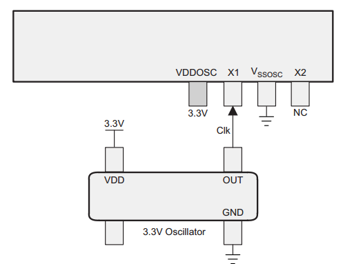

#### External oscillator (XTAL)
1. 3.3V external oscillator: Connect Clk to X1. X2 is NC. VDDOSC is at 3.3V, VSSOSC is at GND.
2. Crystal: Connect XTAL to X1 and X2. VDDOSC is at 3.3V. Connect capacitors between X1-VSSOSC and X2-VSSOSC
3. External resonator: same as XTAL.

Our design:

#### AUXCLKIN
Seems optional. Just connect CLK of an external oscillator (3.3V) to this pin.

#### ERRORSTS
Always output. Low unless an error is detected in chip. Remains high until the error flag is cleared. An active-high pin. Connect external pull-down.

#### XCLKOUT
GPIO73. The clock signal is chosen using the CLKSRCCTL3.XCLKOUTSEL bit field while the divide
ratio is chosen using the XCLKOUTDIVSEL.XCLKOUTDIV bit field.

#### PLL
fPLLSYSCLK = fOSCCLK * (SYSPLLMULT.IMULT + SYSPLLMULT.FMULT) / SYSCLKDIVSEL.PLLSYSCLKDIV
fAUXPLLCLK = fAUXOSCCLK * (AUXPLLMULT.IMULT + AUXPLLMULT.FMULT) / AUXCLKDIVSEL.AUXPLLDIV

#### Boot modes
GPIO72 and GPIO84

.
