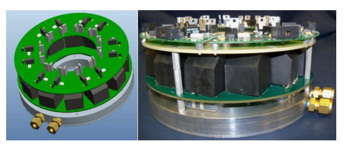

In this document, general information related to IMMD concept will be compiled such as; advantages, disadvantages, challenges, applications etc.

## Problems with conventional drives
* Increased footprint (cabinet)
* Increased volume and weight
* Long cable effect: Aging of stator induclation layers
* Reqires filters for long cable effect

Long cable effect:

## Piggybacked Integration
* Servo, BLDC, induction, stepper
* Can communicate. Control of multiple distributed motors.
* Lenze can be controlled by smartphone.
* Simple data collection and diagnoses.
* Reduced installation space
* Reduced length of power cables

Piggybacked design (physically mounted on top of the motor):

## Segmented Drive
* The stress on each module is reduced
* The motor drive has a round shape, can be mounted on the back side of the motor
* More compact than piggybacked

## Matrix motor:
* Semiconductor switches can be
mounted around the motor.
* Switches are used for online reconfiguration of the motor.

## IMMD with Modular stator
* Motor is modularized and segmented
* Stator piece that has a concentrated coil winding ?
* Power converter dedicated to the stator piece and corresponding gate drivers

## Advantages of IMMD
* Without the transmission cable, EMI and long cable effect are greatly attenuated.
* Extra expense of power connecters and power cables are reduced.
* Cost of IMMD is reduced due to modular design.
* Fabrication cost is reduced due to the mass production of smaller converter modules.
* Maintenance is also less expensive because when IMMD fails, only the broken module needs to be replaced.
* Thermal performance is better. Several IMMD modules share the same total power but semiconductor devices are spread out with larger surface area per volume.
* Hot spot temperature of IMMD is reduced.
* Fault tolerance is better because the

## Challenges of IMMD
* The motor temperature can be too high and damage the power devices.
* Bulky capacitors take a large volume, which will inevitably increase the size and weight of IMMD.
* Physical vibration.
* To simply cut the PCB into a round shape is not an effective way.
* Requires optimal placement of components.

## Solutions Proposed
* Capacitor size reduction, better efficiency and easier thermal management with GaN.
* Reduced voltage stress on capacitor and device with multilevel converter (MLC).
* Reduced loss and cost of devices with reduced voltage rating (MLC).
