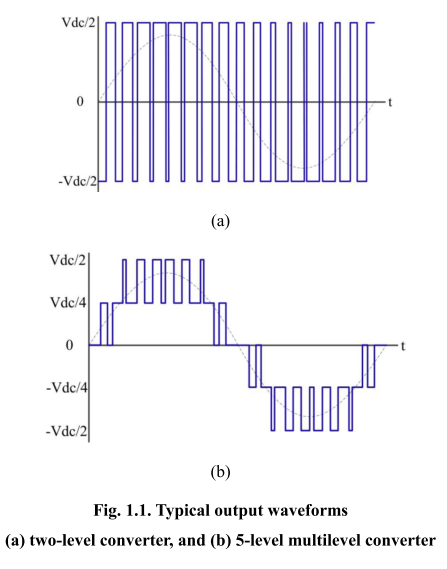

# Inverter topologies
Multilevel converter advantages:
* Reduction in voltage stress on semiconductors
Semiconductor rating for a 2-level converter is Vdc, 3-level converter is Vdc/2, 5-level converter is Vdc/4 and etc.
* Quality of output voltage waveform is improved
* THD is reduced

A sample set of waveforms is shown below:

If FET type semicondcutors are used, voltage rating has worse effect on on-state resistance.
* Bu sanırım switching loss için de geçerli. Buna bakılacak.

# Neutral point clamped  (NPC) multilevel converter
The circuit schematic is shown below:

There are total n+1 output voltage levels,

* An n+1 level NPC converter typically consists of n series capacitors with a voltage rating of Vdc/n.
* All switches and diodes are also rated at Vdc/n.
* The number of diodes in an n+1 level, 3-phase NPC converter is 3n(n-1), yielding a quadratic growth as a function of n.

# Flying Capacitor (FC) multilevel converter
The circuit schematic is shown below:

* There are total n+1 output voltage levels,
* An n+1 level FC converter has n DC-link capacitors and 3n(n-1)/2 flying capacitors.

# Cascaded H-bridge (CHB) multilevel converter
The circuit schematic is shown below:

* A 2n+1 level CHB converter consists of n H-bridges in each phase
* It is possible to generate an output voltage of ±kVdc/n (k from 0 to n).
* CHB converters are supplied by isolated voltage sources or phase shift transformers for each bridge. Extra cost.
* Each H- bridge only supplies a single-phase module and the instantaneous power from the input DC source is fluctuating.

# Topology with transformers
The circuit schematic is shown below:

* One DC source for each three phase (instead of one phase).
* Capacitor size is reduced.
* Extra transformer is required

# Topology with multiwinding transformer at front-end
The circuit schematic is shown below:

* Utilizes machine winding properties (three-phase groups)
* Separate three-phase inverter for each group
* Each inverter needs individual DC source
* Front-end rectifiers and transformers are expensive

# Hexagram converter topology
The circuit schematic is shown below:

* Six 3-phase inverter bridges interconnected through inductors.
* The voltage stresses on each inverter are further decreased.
* Has a lower DC capacitance requirement than a CHB converter.
* Requires isolated voltage sources
* Needs extra inductors.
* Certain switching patterns are prohibited in order to prevent circulating current between different inverter modules.

# Modular multilevel converter (MMC) topology
The circuit schematic is shown below:

* Single input (DC link)
* Requires filter inductor in each arm
* Since the module of MMC forms a boost converter topology, the component voltage in MMC must be slightly higher than Vdc/n.
* Control is more complicated.
* Suitable for FACTs applications.

# Modular high frequency converter (MHF) topology
The circuit schematic is shown below:

* The module capacitors will buffer the single phase fluctuating power, so MHF topology needs some design considerations on the capacitor size.
* The module capacitors must deal with the negative instantaneous power.
* Since the module of MMC forms a boost converter topology, the component voltage in MMC must be slightly higher than Vdc/n.

# Topology Proposed by Wang, Jiyao (Wisconsin)
The circuit schematic is shown below:

* The motor is segmented with three-phase modules.
* Utilization of the motor for isolation of CHB cells.
* Requires only one DC source.
* Three-phase modules are connected in series on their DC link.
* No requirement for extra components like clamping diodes, flying capacitors, filters etc.
* Modular

# Extended Topology Proposed by Wang, Jiyao (Wisconsin)
The circuit schematic is shown below:

* Combination of segmented machine configuration with NPC topology to further relax the stresses on the devices.
* Flexibility

# Topology Comparison (quantity)

# Topology Comparison (capacitor size)

# Topology Comparison (voltage stress)

# Topology Comparison (voltage stress on machine terminals)

