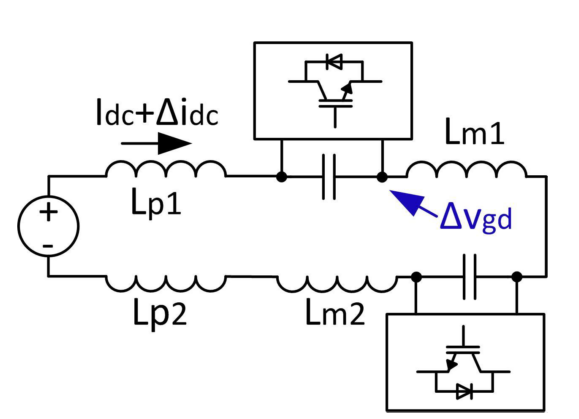
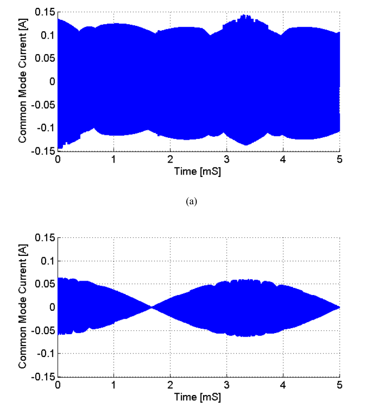
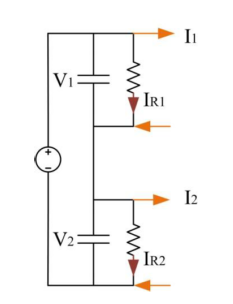
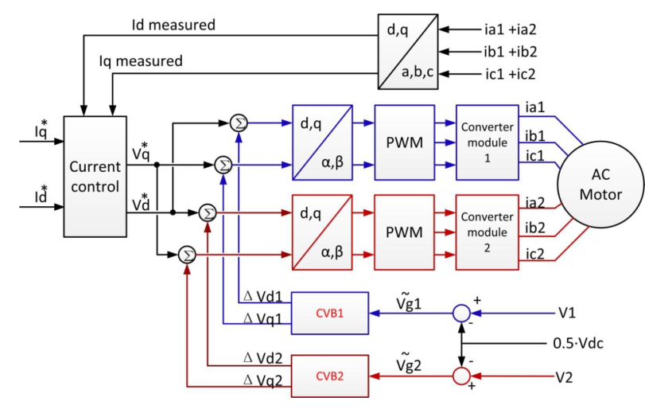
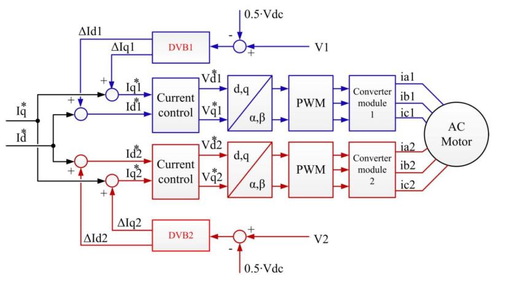
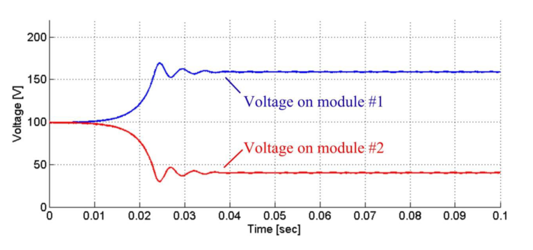

# Interleaving

## Effect of Interleaving on input current

## Effect of Interleaving on DC link current ripple and EMI (ground voltage)
* Parasitic inductances (around 100nH)
* Parallel connected:

* Series connected:

* Cause resonance problems at high frequencies and current ripple may even get worse with parallel connection.
* Cause EMI problem (common mode) and that Situation also worsens at very high frequencies

## Common mode currents in motor housing

## Capacitance in the same slots

## Common mode currents w and w/o interleaving

## Effect of Interleaving on machine current
* Machine Segments in Same Pole Pair but Different Slots: No significant Effect
* Machine Segments in Same Slots: There are parasitic capacitances. Any voltage mismatch will lead to large ripple currents. Interleaving is not recommended. This effect may be reduced by LC filters.

# Voltage balancing in series connected converter topology

## Passive voltage balancing

* With resistors
* Small resistors will have better balancing capability
* Small resistors have significant loss
* Passive voltage balancing techniques:

* They will fail when there is a large mismatch as follows:

## Centralised voltage balancing (CVB) control
* Block diagram is shown:

* Under mismatch, the voltages are balances as shown:

## Distributed voltage balancing (DVB) control
* Block diagram is shown:

* Unstability problem as shown:

# Voltage balancing for Machine Segments in Different Slots
* Equivalent circuit is shown:

# Voltage balancing for Machine Segments in Same Slot
* Equivalent circuit is shown:

* The machine segments in same pole pair has much stronger passive balancing performance.
* Due to the existence of parasitic capacitance, the machine-drive system will be very sensitive to PWM signal mismatch.
* Effect of mismatch on the PWM voltage on the current is shown:

* CVB and DVB are not even needed in this case because the inherent passive balancing is strong enough.
