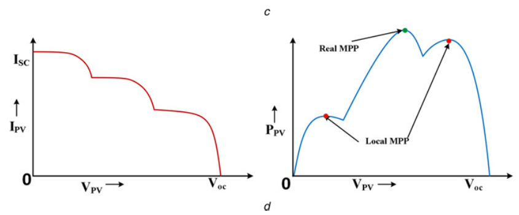

##### Introduction:

The idea is to use a novel method called **Optimum Power Point Tracking (OPPT)** instead of **Maximum Power Point Tracking (MPPT)** in grid connected photovoltaic systems to get the maximum available power from the solar panels as well as compensate the reactive power demanded by the PCC. It has already been shown that if reactive power compensation is applied in low voltage networks, it will be beneficial to the customer since the amount of reactive power charge is much larger than the additional power loss as well as the loss of uninjected power.

**Another idea:** sensing the reactive power requirement of the grid without any additional sensors for measuring reactive power. It may be done by using the voltage variation information. There may not be communication also.

**Other works**: The PV overvoltage (disconnect) problem due to sudden load changes. Contribution of PV inverter to voltage regulation.

**Ultimately**: The algorithm may be based on varying electricity prices. Some neural network stuff may be involved. Moreover, it may be a combination of EV charging (on-board) and rooftop PV systems for small scale residential customers.

##### A few notes from literature:

* unavoidable **partially shaded conditions** (PSCs)
* conventional perturb and observe (P&O) MPPT method
* modified incremental conductance (INC) algorithm that
* global peak (GP) track subroutine
* The methods based on neural network (NN) have
* particle swarm optimisation (PSO) which
* optimized reactive power compensation algorithm (RPCA):

.
