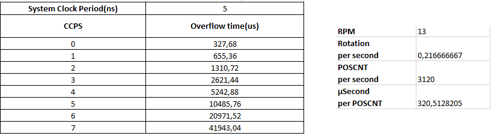
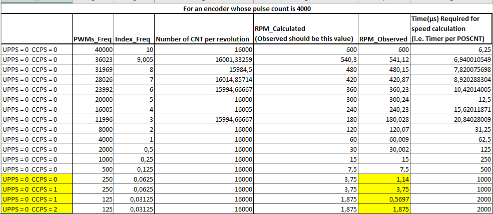

## Teorik altyapı
Motorun üzerinde bulunan enkoder 3600 pulse'lık bir enkoder. Bu pulse sayısına sahip bir enkoder ile DSP 360/(3600*4) hassasiyetinde pozisyon ölçümü yapabilmektedir. 

Her bir artırım değerini DSP QPOSCNT registerı içerisine atar. Bu sayede bir turda 3600*4 sayım yapar. Hız ve pozisyon hesaplamalarında bu değer önemlidir. Ayrıca hız hesaplarken zamanlama da tutulması gerekmektedir. 

Hız hesaplaması yaparken 2 farklı yol vardır. Birisi zamanı sabit tutup alınan yola bakmak, diğeri ise alınan yolu sabit tutup zamanı ölçerek hız hesabı yapmak. İlk yöntemle yüksek hızlarda daha doğru sonuçlar elde edilebildiği 28379D'nin reference manual dokümanında belirtilmiştir. Fakat bizim operasyon aralığımız için ikinci yönteminin yeterli olduğunu düşünüyoruz (0-600RPM). 

UPPS(unit position event prescaler) registerına girilen değerle her kaç QPOSCNT olayında bir hız hesabı yapacağımız belirtebiliriz. Hız hesabını sık yapmak istediğimiz için biz bunu her bir QPOSCNT eventinde yapmayı planladık. Zaman ölçümleri ise DSP içerisinde QCPRD registerından okunmaktadır. QCPRD içerisinde tutulan zamanın prescale değeri CCPS registerı ile ayarlanmaktadır. CCPS 0 ise QCPRD içerisindeki değer system clock değeriyle birlikte artmaktadır. CCPS 1 iken her 2, 2 iken her 4 clock'da bir QCPRD güncellenmektedir. Prescale değeri 128 clock'da 1'e kadar çıkarılabilmektedir.

Hız hesabı yaparken (UPPS her QPOSCNT olarak ayarlandığı için) her QPOSCNT olayında aradan geçen zaman QCPRD'ye kaydedilir ve QEPSTS.UPEVNT registerı kullanılarak bir QPOSCNT olayı olduğu ve QCPRD'de zaman bilgisi bulunduğu bildirilir. 

Burada şu nokta önemlidir. QCPRD registerı 16bitlik bir register olduğu için hız ölçümü yaparken timer registerı (özellikle düşük hızlarda) overflow olabilir. Bu durum QPOSCNT'lar arası zamanın uzamasından kaynaklanmaktadır. **Bizim motorumuz için 3600 pulse bir enkoder ve 200MHz clock'a sahip bir DSP için hesaplandığında 13RPM ve üzerinde bu tarz bir sorun yaşanmayacağı ortadadır. Aşağıdaki tabloda görüldüğü üzere 13 RPM'de dönen bir 3600 pulselık bir enkoder için zaman başına düşen QPOSCNT değeri yaklaşık 320.5µs iken QCPRD 327.68µs'de overflow olmaktadır.** 
Eğer daha düşük RPM değerlerinde hız ölçümü yapılmak isteniyorsa CCPS registerının değeri artırılabilir.

## Test rutini
Enkoderin yapısını test eden bir rutin oluşturuldu. Enkoder yapıları PWM waveformlarıyla taklit edilerek gerekli hız değerlerine ulaşıp ulaşılamadığı ve ne hassasiyette&sıklıkta hız hesabı yapılabildiği gözlemlenmeye çalışıldı. Hız ve pozisyon hesapları 40µslik bir PWM ISR'ı içerisinde yapıldı.

Oluşturulan rutinle, PWMler 4000 pulse'lık bir enkoderi simule edecek şekilde ayarlandı. hız ölçümleri geniş bir aralıkta yapıldı. Sonuçlar aşağıdaki tabloda sağlanmıştır. 

**EVM'in clock frekansı 100MHz** olduğu için ve simule edilen enkoder 4000 pulse'a sahip olduğu için testlerdeki overflow olma limiti 6RPM'e kadar düşmüştür. Yukardaki tablodan da anlaşılabileceği üzere 7.5RPM'e kadar hız okumalarında herhangi bir hatayla karşılaşılmamıştır. 3.75RPM denerken QCPRD overflow olayından dolayı zaman ölçümü hatalı çıkmıştır ve bir sonraki testte CCPS değeri 0'dan 1'e çıkarılmıştır. Bu sayede hız ölçümündeki hatanın giderildiği gözlemlenmiştir.
Aynı durum 1.875RPM'de de ortaya çıktığı için bu sefer CCPS değeri 2'ye çıkarılmak durumunda kalmıştır. 

6RPM'lik değerin doğrulunu test etmek için ufak bir test daha koşturulmuştur. Sonuçlar aşağıdaki gibidir. 6RPM'de zaman ölçümü sağlıklı bir şekilde yapılırken 5.25RPM'e düşünce overflow'den dolayı hız ölçümü yanlış çıkmaktadır. CCPS değeri artırıldığında ölçümün doğru olduğu gözlemlenmiştir.
