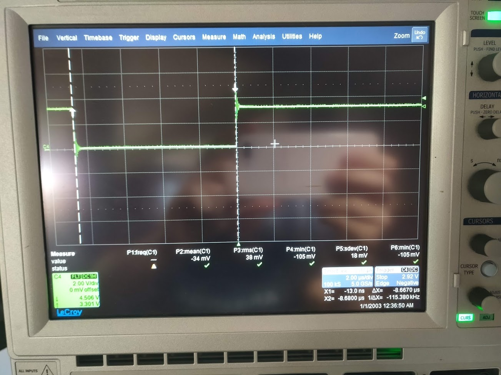
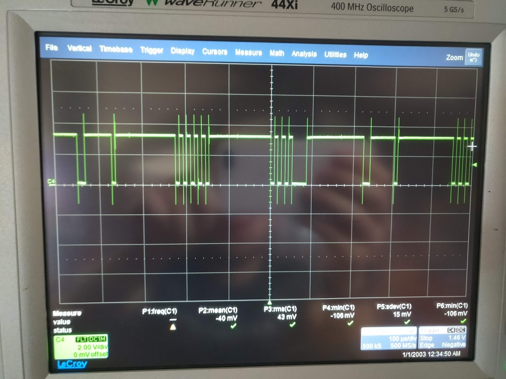

- SCI communication interface has been initialized. It can only send 1 byte at a time. However it has a nice FIFO mechanism built into it, which can buff 16x1 bytes for data both for transmit and receive side. Using it we can generate interrupt when there are (for example) 4 bytes of data inside the fifo. To send variables that are larger than 1 byte, parsing operation has to be made (both for receiver and the transmitter). The configration&test file can be found in this folder.

Current operation
- SCIB is set as transmitter SCIC is set at receiver
- Baud rate is set to 115200 for both
- FIFO mechanism enabled for both
- No interrupts utilized for now.
- Timing measurements are made to validate the baud rate. For 115200 baudrate the duration of each bit is around (1/115200)=8.68μs. In the following picture a timing measurement is shown. 

In the next figure, consecutive data sending is performed. Three different bytes , 01010101 00010101 11111110, are being sent in order with around 220µs delay between each byte. 

The configuration is as follows
- 1 start bit (low)
- 1 stop bit (high)
- Odd parity is enabled
- LSB sent first

# TODOs
- Using interrupts for communcation.
- Parsing operation for multiple byte variables on the sending side.
- Receiving the parsed bytes and construct useful information out of it on the receiving side.
