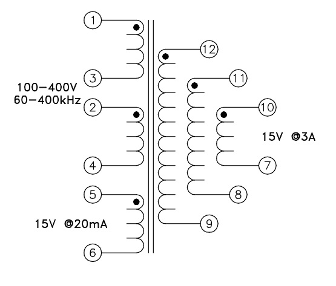
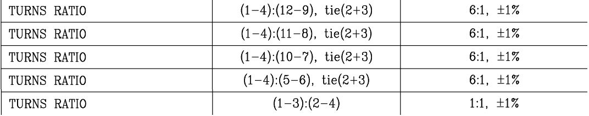

# Introduction   
Flyback converter is one of the most used **isolated** DC-DC converter type up to 100 W applications. One of the advantages that Flyback converters  have their multi-output voltage abilities. Its basic circuit is given below. 

  
In this circuit, Vd will be yield by diode rectifier and will be almost 310V. Output voltages can be increased by using multiwinding transformer. This is one of the most important feature of Flyback Transformer since the outputs require additional winding, one diode and one capacitor.

- In this design, three isolated output voltages is required. ( +5V,+5V,+15V ) 
- The output currents will be respectively 2A, 2A and 3A. Therefore, the controller to be designed will be **65W**.

Note that in the flyback controller, only control parameter is the duty cycle. Therefore, this will result in one regulated and two unregulated output voltages. 

#DCM or CCM?

- http://www.infineon.com/dgdl/AN_SMPS_16822CCM_V10.pdf?fileId=db3a304412b407950112b418d12226b8
- http://ecee.colorado.edu/copec/book/slides/Ch5slide.pdf
- http://nptel.ac.in/courses/108105066/PDF/L-22(DP)(PE)%20((EE)NPTEL).pdf
- http://ecee.colorado.edu/~ecen4517/materials/flyback.pdf

In the DCM operation, high ripple occurs in the current waveform which results in small inductance. However, in DCM operation duty cycle appears in the output power expression.CCM operation, these do not occur. Note that, in CCM operation there is a risk saturation since the flux is not zero at the end of each switching period. Moreover, using DCM topology, transformer size is reduced. Therefore, DCM operation is preferred in this design.

# Controller  
One of the most important parameter in the Flyback Converter is the Controller. Flyback Converter is generally employed as isolated voltage source for other equipments as DSP, Rasp-pi or any other mechanisms that need to be powered. Therefore, it is powered from the axillary winding of the Flyback-Transformer. Therefore, the controller input source does not need to be regulated. In the data sheet, minimum and maximum input is specified. Therefore, the Flyback Transformer and Controller should be complied with each other. 

#Flyback Transformer 

Flyback transformer commercially exists in the market. Its specific property is its axillary winding that will supply power to the controller. 

- http://productfinder.pulseeng.com/files/datasheets/P719.pdf
- https://media.digikey.com/pdf/Data%20Sheets/Pulse%20PDFs/PA0367A.pdf
- http://katalog.we-online.de/pbs/datasheet/750370040.pdf

My main problem is their input voltage values. They are like 60 V meanwhile I need almost 310 V input voltage. 

**Isolation Voltage**  
Isolation Voltaege of the transformers: 500V,1.5kV,2.5kV and 4kV. Since the input voltage will be the output voltage of the diode rectifier, in my opinion 500V isolation will be sufficient. 

#Useful Documents 

- http://www.ti.com/lit/ml/slup072/slup072.pdf
- https://www.fairchildsemi.com/application-notes/AN/AN-4137.pdf
- http://www.ti.com/lit/an/slua086/slua086.pdf  
- http://pdf.dzsc.com/2000625/200006250943377744.pdf

#Second Week Report  

**Improved Feedback**  
Note that we will have three isolated output voltages. However, it is not possible to regulate three output voltages. An improved feedback mechanism can be applied to the circuit. In this case, three output voltages can be regulated. Note that in this case, all voltages would not tightly regulated as in the case of one regulated output voltage case.  

  

**Flyback Transformer options**  
Since we are asked to have three regulated output voltages, it might be better to either **design the transformer with one controller** or **three controller and three transformer**.  

http://katalog.we-online.de/pbs/datasheet/750311771.pdf
http://katalog.we-online.de/pbs/datasheet/750311591.pdf

Usefull documents for transformer design:  
- http://pdf.dzsc.com/2000625/200006250943377744.pdf  

#Third Week Report  

In the second week meeting, it is decided that we will have three 15V outputs. One of them will be connected to 
mainboard. Other two will be connected to a commercial buck converters with 5V outputs.  

For this application, following transformer has been chosen.  

  

http://www.digikey.com/product-detail/en/wurth-electronics-midcom/750311771/732-2667-2-ND/2445674 

Turns ratios are given below.

  

  For the buck converter **LMZ12002** is chosen. 

<<<<<<< HEAD
 - http://www.ti.com/lit/ds/symlink/lmz12002.pdf

#Fourth Week Studies  

In previous week, it is decided that flyback converter does not need isolated outputs due to the common ground structure in their communication systems. 

-  Therefore, one output winding(paralleled two winding) will be connected to mainboard with regulated output voltage of 15V.
-  The other 5V will be achieved with an output winding by using a commercial buck converter. 
  
But the problem is it is written that "15V 3A" but in what condition? All of them paralleled or only one winding?  
 
In previous week, the buck converter was already chosen but it is stated that its output current is up to 2A! 

Depending on the Raspberry Pi to be used, this current might not be appropriate ! 

  
 
Source: https://www.raspberrypi.org/help/faqs/ 

Moreover, this week Altium is installed and after making sure on all equipment, schematic construction will be started.
=======
 - http://www.ti.com/lit/ds/symlink/lmz12002.pdf 

For controller, UCC28610 will be used. Its temperature range is also maximum according to catalog (-40 to 125 C ).

http://www.ti.com/lit/ds/symlink/ucc28610.pdf
>>>>>>> e1f5643fbae52c089c2aa09ae1156a7bceebbb7e
