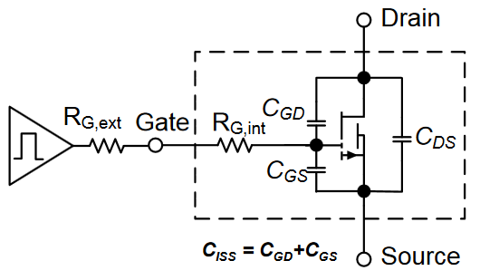
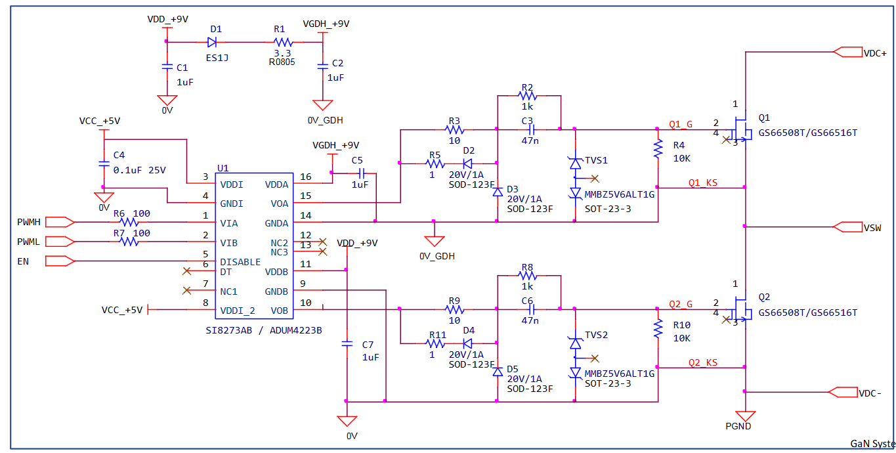

In this file, issues regarding **GaN FET utilization from GaN Systems** in the IMMD system will be discussed. The issues contain, GaN limitations, EMI problems, gate drive strategies, measurement techniques, power stage layout design, gate drive layout design etc.

### GaN Systems, GN001 Application Guide, Design with GaN Enhancement mode HEMT
* Higher gain and lower VGS:+5-6V gate bias to turn on
* Lower VG(th): typ. 1.5V
* +7/-10V DC max rating
* No QRR, only QOSS loss
* it is naturally capable of reverse conduction without external anti-parallel diode
* Reverse conduction has a ‘diode’ like characteristics and it is VGS dependent
* VSD higher than typical diode – minimize dead time and use synchronous drive
* Dead time for hard switching: td_pwm must be > tdelay_skew + (td(off)-td(on))
* For GS66508 typical 50-100ns is chosen for dead time

##### Gate Drive Design
* GaN **dv/dt > 100V/ns** typically
* High dv/dt and di/dt combined with low CISS and VG(th) → Need to protect gate spikes from going above threshold or maximum rating **under miller effect** for safe operation
* **Gate drive impedance** (Rg and Lg) is **critical for turn-off**, but less at turn-on
* Miller effect is more prominent at 650V than 100V design due to the higher dv/dt
* **Use negative gate bias**, -2 to -3V is recommended
* Pay attention to the VGS spike around VDS<50V due to the change of non-linear CISS/CRSS ratio (negative dv/dt case)
* A **clamping diode** is recommended for gate drive with single output.
* Negative gate bias can help to prevent false turn-on, but ensure **worst case Vgs-negpk within -10V**
* Critical to choose the right **RG(ON)/RG(OFF) ratio** for performance and drive stability
* Recommend **RG(ON)/RG(OFF) ≥ 5-10 ratio** for controlling the miller effect
* Most cases **0402/0603 SMD** resistors can be used
* For GS66508: recommend to start with **RG(ON) = 10-20Ω**
* Typical starting value range **RG(OFF) = 1-2Ω**

 

##### Ringing and Oscillations
* Gate over/undershoot and ringing caused by **high LG**
* **Common Source Inductance LCS** Feedback path from power to gate loop (di/dt)
* Capacitive coupling via **miller capacitor CGD** (dv/dt)
* Locate **driver as close to gate as possible**
* Low inductance **wide PCB trace and polygon**
* Use **kelvin source connection** to minimize LCS
* Use a **ferrite bead** with Z = 10-20Ω @100MHz in series with gate. (ferrite bead may increase LG but damp the high frequency gate current ringing)
* Use RC snubber across G-S: example R = 3.3Ohm / C = 200-470pF

  

##### High side gate drive
* Minimize **Coupling capacitance CIO**
* Use isolator/isolated gate driver with **high CMTI** (Common-mode transient immunity)
* Choose the **bootstrap diode** with low CJ and fast recovery time. Watch for bootstrap diode power loss limit and recovery time for high-frequency operation.
* Post-regulation or **voltage clamping** to ensure high side bias <7V  (bootstrap)

 

##### Select gate driver
* **Undervoltage lockout** (UVLO)
* For 0-6V drive bias: use **UVLO ≤ 4-5V** (designed for 5V FET gate drive)
* For -3/+6V bipolar drive: use driver designed for 9V gate drive **(UVLO < 8V)**
* Recommend ≥ 4A sink current (turn-on peak current requirement can be relaxed)
* Low pull-down resistance
* Isolated gate driver: **dv/dt CMTI rating**: at minimum 50kV/us, preferred ≥100kV/us
* Capable of high frequency operation: **Fsw ≥ 1MHz**

##### Recommended gate drivers (Silicon Labs - For inverters)
* Single channel Si8271 (single w/ split output)
* Half bridge Si8273/4/5 (HS&LS, PWM with DT Adj or dual)
* Use 3V UVLO version (XX-GB) for unipolar 6V gate bias. For +6/-3V bipolar drive either 3V or 5V UVLO (XX-AB) version can be used
* Analog device half bridge driver ADuM4223A/B

###### Isolated gate drive - unipolar

###### Isolated gate drive - bipolar

###### Isolated gate drive - bias offset

###### Bootstrap gate drive - bias offset

###### Nonisolated bootstrap

###### Nonisolated bootstrap - bias offset

###### Local driver - gate drive can be located at distance

##### PCB layout
Minimize with the following order:
1. Common source / mutual inductance LCS
2. Gate loop inductance LG
3. Power loop inductance Lloop
4. Drain to gate loop capacitance CGD_ext
5. Isolating coupling capacitance CISO

.
