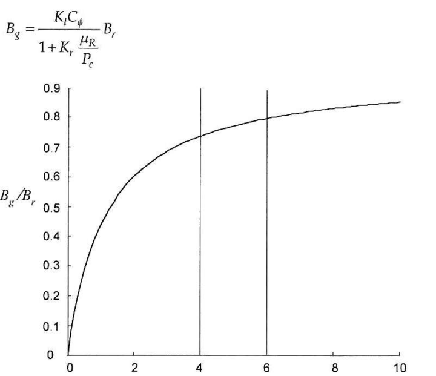

##### In this file, notes from the book "Brushless Permanent Magnet Motor Design by Dr. Duane Hanselman (Second Edition)" are collected. The book is available on Mendeley folder.

Classification of electric motors:

Learn about the relations between the following:
* Reluctance torque
* Cogging torque
* Torque ripple

Torque ripple is caused by electrical harmonics. Cogging torque (reluctance torque) is caused by space harmonics.

Some analytical models proposed for Carter's coefficient:

A nice magnetic model for a BLDC motor:

The relationship between remanence magnet flux density and air gap flux density. This is the heart of the design. Kl is the leakage factor (0.9-1.0), Kr is the reluctance factor (1.0-1.2) and Cphi is the flux concentration factor (close to 1, ideally 1). Actually, the air gap flux density is determined by the magnet properties and air gap-magnet length relationship.

.
