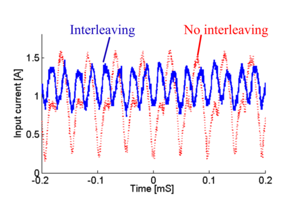

# Interleaving

## Effect of Interleaving on input current

## Effect of Interleaving on DC link current ripple and EMI (ground voltage)
* Parasitic inductances (around 100nH)
* Parallel connected:

* Series connected:

* Cause resonance problems at high frequencies and current ripple may even get worse with parallel connection.
* Cause EMI problem (common mode) and that Situation also worsens at very high frequencies

## Common mode currents in motor housing

## Common mode currents w and w/o interleaving

## Effect of Interleaving on machine current
* Machine Segments in Same Pole Pair but Different Slots: No significant Effect
* Machine Segments in Same Slots: There are parasitic capacitances. Any voltage mismatch will lead to large ripple currents. Interleaving is not recommended. This effect may be reduced by LC filters.
