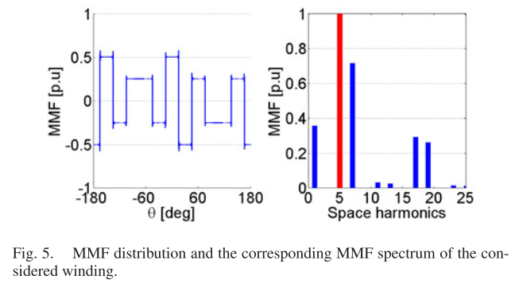
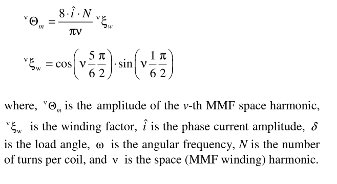
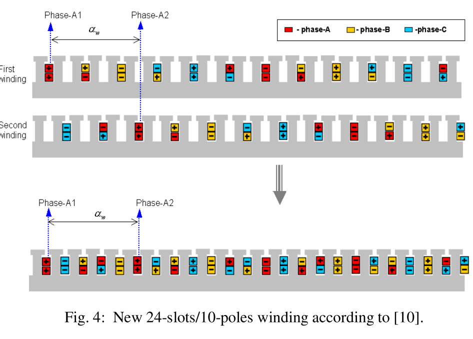
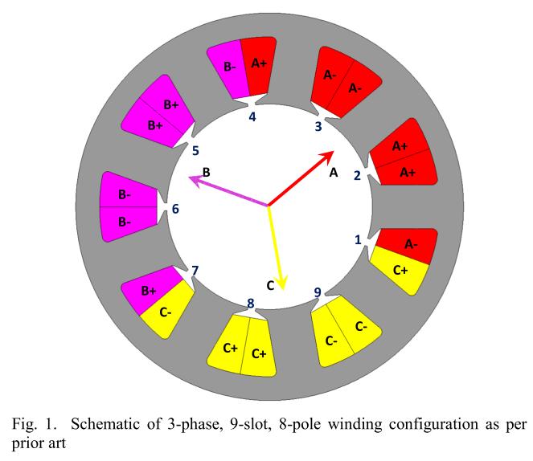
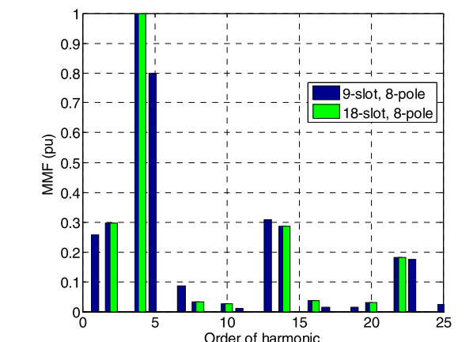
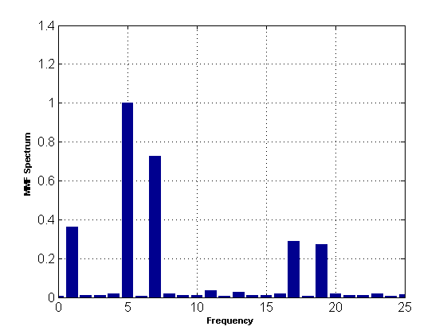
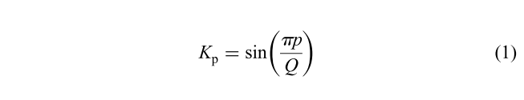
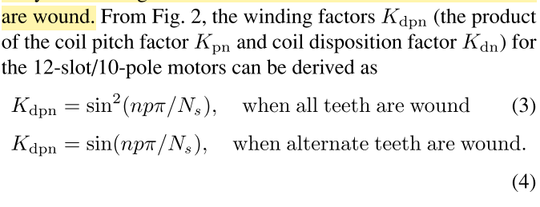
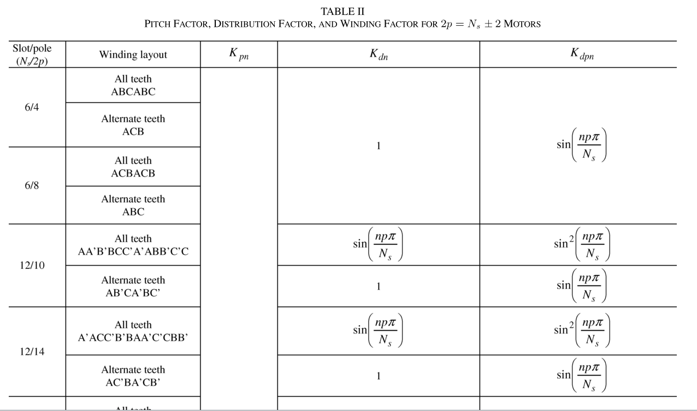
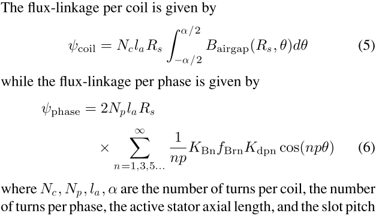

### Fractional Slot Concentrated winding Permanent Magnet synchronous Motors

FSCW PMSMs are mostly used in low speed high torque applications thanks to their high torque density,low cogging torque and low manufacturing costs, reduced probability of inter-phase fault.
On the other hand, they have low fundamental winding factor and high MMF space harmonic content. This may lead to localized core saturation, additional stator and rotor core losses, eddy current losses in magnets, acoustic noise and vibration. **This may yield a thermal demagnetisation of the PM due to excessive overheating.**

Methods proposed to overcome these effects:
* Novel unequal teeth methods
* Dual three phase strategy
* More than 2 layer winding
* Concentrated coils with different number of turns per coil-side
* Using magnetic flux barriers in stator yoke
* Stator shifting technique => leads to over-lapping windings

**The winding must present a symmetric distribution along the air gap to avoid unbalanced magnetic force which generates noise and vibration.** This is especially important for IMMD design and fault tolerance.
**Each slot must have another slot diametrically opposed, that will contain the same number of conductors.** This condition allows also getting an MMF waveform without even number of space harmonics.

**The number of slots must be even and multiple of number of phases: ex. 6, 12, 18, 24.....**

**To reduce manufactueing costs and achieve high fill factor, single layer or double layer winding should be used (not higher).**

With the given conditions, the harmonic content (space harmonic of MMF) will be: 5,7,11,13,17,19,23,25......

The following is a commonly used winding configuration for a 12/10 motor according to a recent paper. It has low cogging torque, low harmonic content and balanced magnetic force.

The following is its MMF distribution of that m/c.

It says that only the fifth harmonic produces torque and the others are undesirable ???????????
It should have something to do with the magnet pole number. Fifth harmonic is equal to the pole pair number.

Now it is clear that with 12 slot stator, 10 (5x2) pole or 14 (7x2) pole rotors are widely used to enhance the corresponding MMF.

The machines with a number of slots per pole and per phase between 1/2 and 1/3 **such as the 12-slots per 10-poles machine**, generally present higher performances and is widely used in many industry application.

Another illustration for 12/10 m/c is as follows:

MMF expression and its harmonics are as follows:

Using shifted windings:

New 24/10 m/c with phase shifted windings: The proposed design takes care of 7th harmonic with proper phase shift, but the 1st harmonic is still problematic. Two methods are proposed for that:

1) using different turns per coil for the neighbouring phase coils

2) using coil windings with different turns per coil side

A **6 phase** FSCW PMSM example will be introduced here. The machine is **18 slot, 10 pole**.

The previous 9 slot 8 pole stator is as followS:

The new 18 slot 8 pole stator is as follows:

MMF comparison of these machines (same pole number, 8)

Using MATLAB, the MMF waveform and its space harmonic spectrum is achieved for the 12/10 case.

Also, the proposed 24/10 machine is also simulated and the results are as follows:

The results show that, 1t harmonic is partially decreased, 7th and 17th harmonics are completely eliminated.

Formulation for winding factor:

This formulation is used in a paper for a five phase machine. Its application to our case does not give correct results.

gcd: greatest common divisor (EBOB): Bu kavramı bir ortaokulda bir de doktoro da kullanmanın haklı gururu :)

Terminology: Harmonics (**v**) of the MMF waveform below number of pole pairs are called **sub-harmonics** while above number of pole pairs are called **super-harmonics**.

In a general FSCW machine, the two most important harmonic components causing most of the eddy-current losses are the 1st harmonic and the (pole pair)+1st harmonic which is also called the significant slot harmonic. In the 12/10 case, this harmonic is the 7th harmonic.

Typical flux and flux density distributions of a 12/10 machine. This example may be useful in future studies on Maxwell.

**Very important information:** The distribution factor is unity, so that the winding factor for a motor in which only alternate teeth carry a coil is higher than that for a motor in which all the teeth are wound. But, motors in which only alternate teeth are wound have higher harmonic winding factors than those in which all the teeth wound.

Another proposition for winding factor (12/10 example):

The following table turned out to be very useful:

For 12/10 machine, these equations hold perfectly.

Another important formulation: flux linkage and induced EMF:

In the literature, it has been noted that, in HEV applications where FSCW PMSMs are used, **conventional 3-teeth/2-poles concentrated winding** with q=0.5 are utilized. But they have low winding factor (about 86%) for the conventional 3-teeth/2-poles winding compared with the others FSCWs (up to 97%).

.
