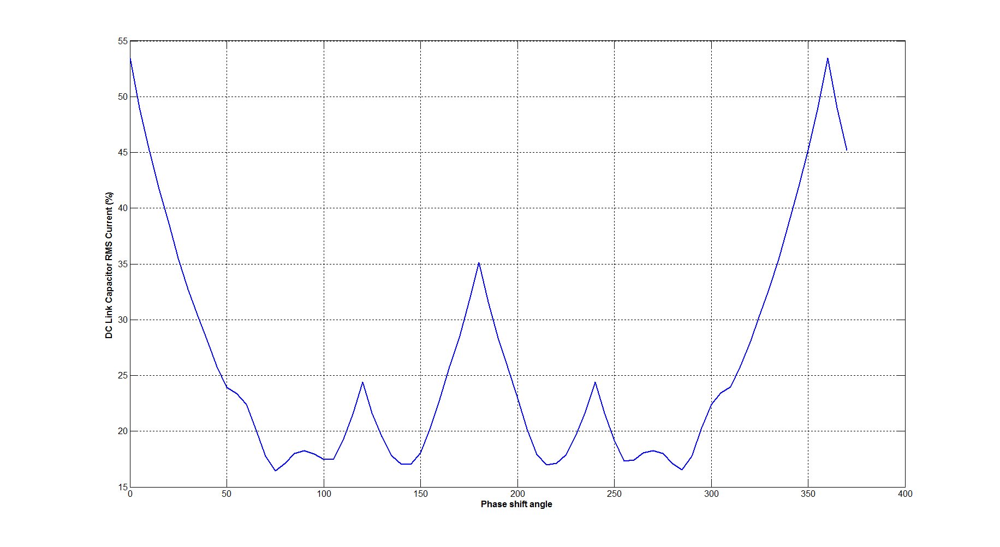

A simulation is performed with 4 modules connected in parallel on DC link. Results of capacitor current (both waveform and RMS) with and without interleaving are shown below:

The correlation between DC link capacitor RMS current and phase-shift angle of the interleaving (4 modules are connected in parallel on DC link):

A more detailed analysis

